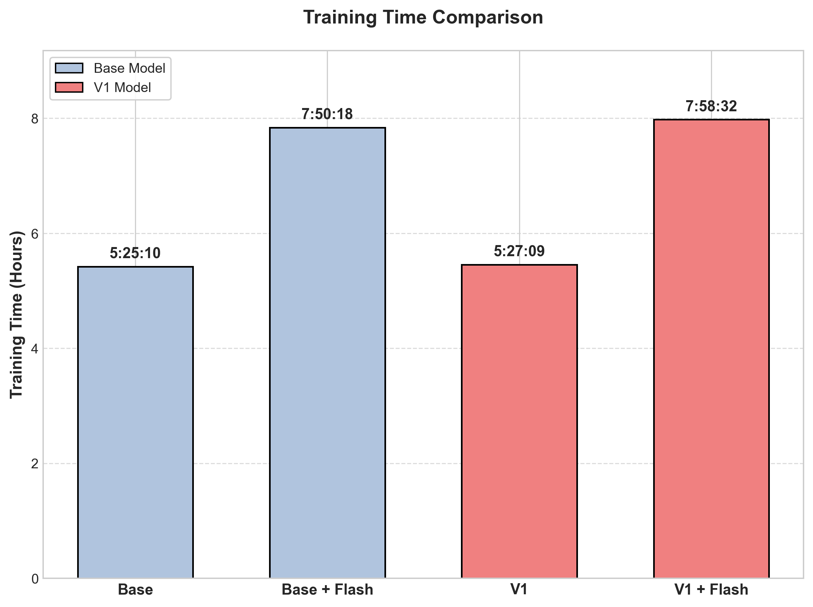

# EfficientViT: Cascaded Group Attention을 활용한 메모리 효율적인 Vision Transformer

이 프로젝트는 모바일 및 엣지 디바이스에서의 실시간 배포를 위해 최적화된 고속 Vision Transformer 아키텍처인 **EfficientViT**를 구현합니다. 기존 ViT의 높은 메모리 액세스 비용과 지연 시간 문제를 해결하여, 성능 저하 없이 효율성을 극대화했습니다.

> [!NOTE]
> 본 프로젝트의 실험은 빠른 반복 연구와 검증을 위해 **CIFAR-10** 데이터셋을 기본으로 진행되었습니다.

## 핵심 방법론

### 1. Sandwich Layout
FFN(Feed-Forward Network)을 어텐션 레이어 앞뒤로 배치하여 네트워크 구조를 최적화했습니다. 이를 통해 메모리 접근 오버헤드를 줄이고 네트워크 내 정보 흐름을 강화했습니다.

### 2. Cascaded Group Attention (CGA)
입력 특징을 여러 헤드로 분할하고 순차적(cascaded)으로 처리하는 새로운 어텐션 메커니즘입니다. 각 헤드가 이전 헤드의 출력을 활용함으로써, 계산 비용을 크게 낮으면서도 풍부하고 다양한 특징을 학습할 수 있습니다.

### 3. Flash Attention 통합
훈련 및 추론 속도를 높이기 위해 Flash Attention을 통합했습니다. GPU 메모리 읽기/쓰기 효율을 최적화하여 연산 속도를 개선했습니다.

### 4. 파라미터 재할당
Query(Q)와 Key(K)의 차원을 전략적으로 축소하여 어텐션 연산 시 메모리 점유율을 최소화했습니다.

## 주요 결과

EfficientViT는 MobileNetV2 및 표준 ViT와 비교했을 때 성능(Accuracy)과 처리량(Throughput) 간의 우수한 트레이드오프를 보여줍니다.


*CIFAR-10 데이터셋에서의 지연 시간 대비 정확도 개선 결과*

### 훈련 및 평가
Flash Attention 적용과 아키텍처 최적화를 통해 훈련 시간과 리소스 사용량을 대폭 절감했습니다.


*다양한 설정에 따른 훈련 시간 비교*

## 시작하기

### 환경 설정
```bash
pip install -r requirements.txt
```

### 데이터 준비
CIFAR-10 데이터를 준비하거나 기본 스크립트를 사용하여 다운로드하세요. (ImageNet 구조도 지원합니다)
```bash
# CIFAR-10 예시
data/
└── cifar-10-batches-py/
```

### 모델 평가
사전 훈련된 모델(예: EfficientViT-M4)을 평가하려면:
```bash
python main.py --eval --model EfficientViT_M4 --resume ./efficientvit_m4.pth --data-path $PATH_TO_CIFAR10
```

### 모델 훈련
EfficientViT-M4를 훈련하려면:
```bash
python main.py --model EfficientViT_M4 --data-path $PATH_TO_CIFAR10 --dist-eval
```

## 벤치마크 및 검증
검증 스크립트와 벤치마킹 툴은 `benchmarks/` 디렉토리에 위치해 있습니다:
- `speed_test.py`: GPU/CPU 환경에서의 처리량 비교
- `verify_flash_attn.py`: Flash Attention 통합 여부 확인
- `benchmark_stages.py`: 모델 단계별 지연 시간 프로파일링

## 참고 및 감사
[Swin Transformer](https://github.com/microsoft/swin-transformer), [LeViT](https://github.com/facebookresearch/LeViT), [pytorch-image-models](https://github.com/rwightman/pytorch-image-models), [PyTorch](https://github.com/pytorch/pytorch)의 오픈소스 코드베이스에 감사드립니다.

## 라이선스
이 프로젝트는 [MIT License](./LICENSE)를 따릅니다.
