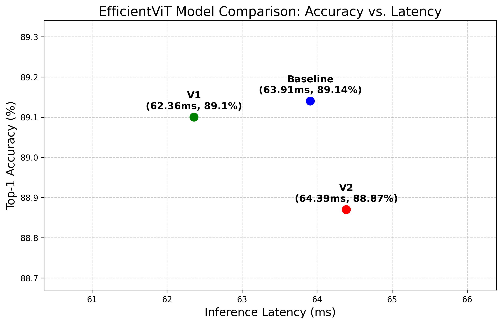
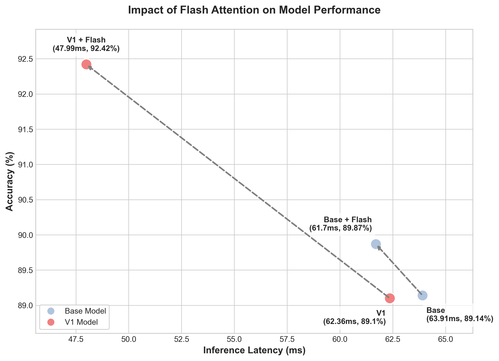

# EfficientViT: Memory Efficient Vision Transformer with Cascaded Group Attention

This project implements **EfficientViT**, a high-speed Vision Transformer architecture optimized for real-time deployment on mobile and edge devices. It resolves the high memory access cost and latency issues of existing ViTs, maximizing efficiency without compromising performance.

> [!NOTE]
> The experiments in this project were primarily conducted on the **CIFAR-10** dataset for rapid iterative research and validation.

## Core Methodology

### 1. Sandwich Layout
The network structure was optimized by placing FFNs (Feed-Forward Networks) before and after the attention layers. This reduces memory access overhead and enhances information flow within the network.

### 2. Cascaded Group Attention (CGA)
A novel attention mechanism that splits input features into multiple heads and processes them sequentially (cascaded). By allowing each head to utilize the output of the previous head, it significantly lowers computational costs while learning rich and diverse features.

### 3. Parameter Reallocation
The dimensions of Query (Q) and Key (K) were strategically reduced to minimize memory footprint during attention operations.

## Key Results

EfficientViT demonstrates an excellent tradeoff between Accuracy and Throughput compared to MobileNetV2 and standard ViTs.


*Improvement in accuracy vs. latency on the CIFAR-10 dataset*

### Flash Attention Integration & Comparison
Flash Attention was integrated to improve efficiency during training and inference. Below is the latency comparison between standard attention and Flash Attention.


*Efficiency comparison of Flash Attention vs. standard attention*

## Getting Started

### Environment Setup
```bash
pip install -r requirements.txt
```

### Data Preparation
Prepare the CIFAR-10 data or use the default script to download it. (ImageNet structure is also supported)
```bash
# CIFAR-10 Example
data/
└── cifar-10-batches-py/
```

### Model Evaluation
To evaluate a pre-trained model (e.g., EfficientViT-M4):
```bash
python main.py --eval --model EfficientViT_M4 --resume ./efficientvit_m4.pth --data-path $PATH_TO_CIFAR10
```

### Model Training
To train EfficientViT-M4:
```bash
python main.py --model EfficientViT_M4 --data-path $PATH_TO_CIFAR10 --dist-eval
```

## Benchmark and Verification
Validation scripts and benchmarking tools are located in the `benchmarks/` directory:
- `speed_test.py`: Throughput comparison on GPU/CPU environments
- `verify_flash_attn.py`: Verification of Flash Attention integration
- `benchmark_stages.py`: Stage-by-stage latency profiling of the model

## Acknowledgement
Thanks to the open-source codebases of [Swin Transformer](https://github.com/microsoft/swin-transformer), [LeViT](https://github.com/facebookresearch/LeViT), [pytorch-image-models](https://github.com/rwightman/pytorch-image-models), and [PyTorch](https://github.com/pytorch/pytorch).

## License
This project is licensed under the [MIT License](./LICENSE).
